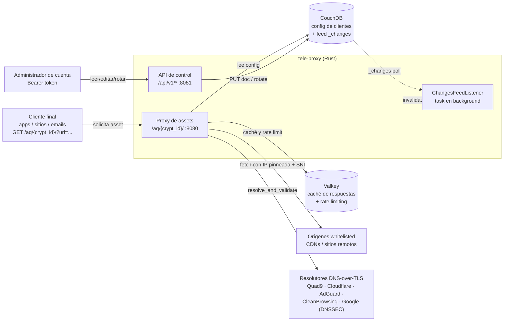
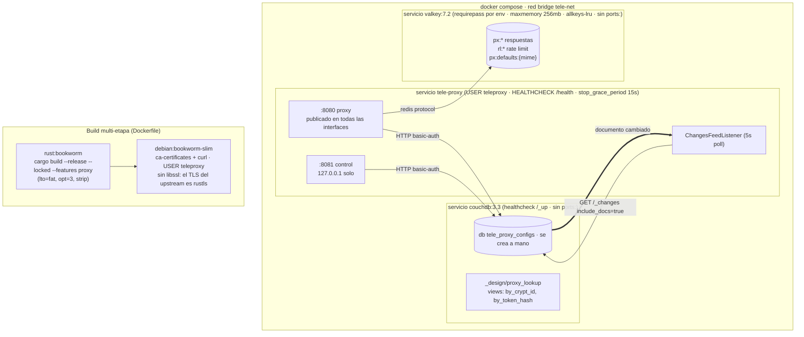
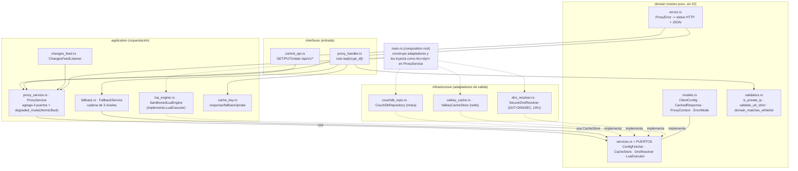
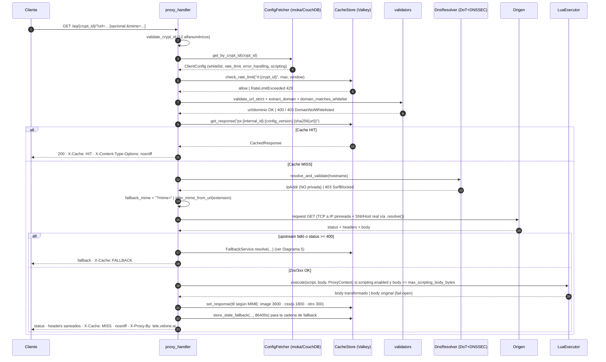
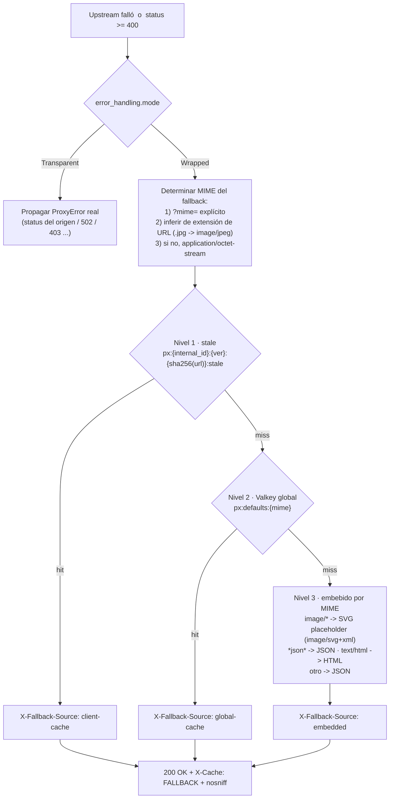
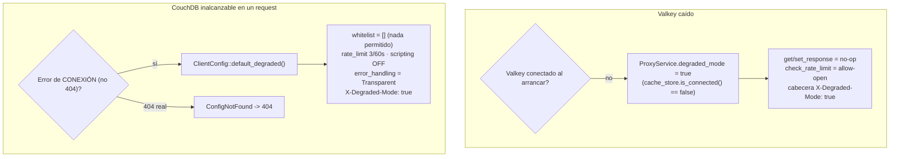
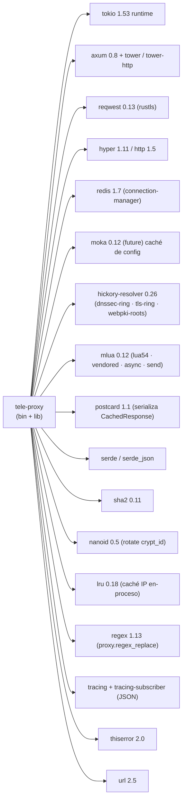
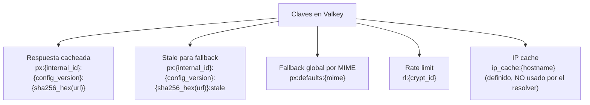

# Diagramas de arquitectura y funcionamiento

Generado a partir del código fuente actual (`src/`), el `Cargo.toml`, `docker-compose.yml`, `Dockerfile` y `config/dns_resolvers.json`. Los diagramas de este documento reflejan la **implementación real de hoy**: servidor **Axum + reqwest**, serialización de caché con **postcard**, y resolución DNS con **LRU en-proceso** (la clave `ip_cache:{hostname}` está definida pero el resolver no la usa).

**Reparto de la documentación**: `docs/spec.md` y `docs/ARCHITECTURE.md` son la **especificación objetivo**, cuyo motor de proxy es **Pingora** (decisión de arquitectura de 2026-10). Este documento es el **inventario fiel del código actual** y, por tanto, la lista de trabajos de portación. La tabla de deltas es la sección [0](#0-estado-actual-vs-objetivo-migración-a-pingora); los diagramas 1-10 describen lo que existe, no lo que se pretende.

Índice:
0. [Estado actual vs objetivo (migración a Pingora)](#0-estado-actual-vs-objetivo-migración-a-pingora)
1. [Contexto del sistema (C4 L1)](#1-contexto-del-sistema-c4-l1)
2. [Despliegue / contenedores](#2-despliegue--contenedores)
3. [Componentes: capas DDD y puertos/adaptadores](#3-componentes-capas-ddd-y-puertosadaptadores)
4. [Ciclo de vida de una solicitud](#4-ciclo-de-vida-de-una-solicitud)
5. [Manejo de errores y fallback por MIME (BDD Feature 5)](#5-manejo-de-errores-y-fallback-por-mime)
6. [Invalidación de configuración vía `_changes`](#6-invalidación-de-configuración-vía-_changes)
7. [Modos degradados](#7-modos-degradados)
8. [Seguridad en profundidad](#8-seguridad-en-profundidad)
9. [Mapa de crates / dependencias](#9-mapa-de-crates--dependencias)
10. [Formatos de clave de caché](#10-formatos-de-clave-de-caché)

---

## 0. Estado actual vs objetivo (migración a Pingora)

| Aspecto | Código actual | Objetivo (spec/ARCHITECTURE) | Divergencia a cerrar |
|---|---|---|---|
| Motor del proxy | Axum `proxy_handler.rs` sobre `reqwest` | `impl ProxyHttp for ProxyService` (Pingora 0.9) | Portar Fase 3; `proxy` sigue siendo feature opcional hasta entonces |
| Cuerpo de la respuesta | `http_client::read_body_capped`: sigue bufferizando el cuerpo completo, pero aborta en el stream si pasa el tope | `response_body_filter` en chunks + tope abortado | Streaming por chunks y requisito BDD de 15 MB sin RAM (Fase 3) |
| Conexión al origen | `http_client::pinned_client`, un `reqwest::Client` por request con `.resolve()` | `HttpPeer(SocketAddr)` con pool keepalive | Reutilización de conexiones y TLS |
| Redirects | `redirect::Policy::none()` dentro de `pinned_client` (se reenvía el 3xx) | Validar `Location` (whitelist + IP privada) | Pasos 5 anti-SSRF; `ssrf_blocked reason=redirect_to_private_ip` |
| Webhooks Lua (`proxy.http_request`) | `application/webhook_service.rs` (whitelist + `resolve_and_validate`) sobre `infrastructure/http_client::pinned_client`, sin redirects; la llamada es síncrona en la VM y delega en `Handle::spawn` | lo mismo | **Cerrado** (P1 de SSRF): `proxy.http_request` ya no puede construir un cliente propio |
| Rate limit | `EVAL` con `INCR`+`PEXPIRE` atómicos; si Valkey cae decide `LocalRateLimiter` (WARN `rate_limit_degraded`); `Retry-After` y contador reales | lo mismo dentro de `request_filter` | Cerrado; solo queda mover el call site (Fase 3) |
| Timeout Lua | hook real `set_global_hook(every_nth_instruction(2000))` que corta la VM en el deadline + `tokio::time::timeout` sobre el `JoinHandle`; `ScriptTimeout` con `elapsed_ms` | deadline que interrumpe la VM | **Cerrado** (P1 del bucle no interrumpible); queda cablear `InstructionCount` en el motor Pingora |
| Caché DNS | LRU en-proceso | igual (decisión confirmada) | Ninguna: la spec se alineó al código |
| Serialización | postcard | postcard | Ninguna: `bincode` se eliminó de la documentación |
| `X-Cache` | `HIT` (`proxy_handler.rs:330`), `MISS`/`BYPASS` (`:200`) y `FALLBACK` (`:299`) como literales dispersos | `CacheDirective::as_str()` compartido por el header y el campo `x_cache` del `logging()` | Alineado: `BYPASS` está en el código y en `api_contract.yaml:443`. Queda extraer el enum (Fase 3) para que header y access log no puedan divergir |
| MIME efectivo | `?mime=` → extensión → `octet-stream` | inserta `Accept` como 3er paso | `Accept` no se lee en ningún archivo |
| `fallback_urls`, `scripting.code_hash` | `code_hash` se verifica con `sha256_hex` antes de ejecutar (digest distinto ⇒ `integrity_check_failed`, cuerpo sin transformar); `fallback_urls` sigue sin lectura | fallback remoto validado + verificación de integridad | Implementar o retirar `fallback_urls` del modelo; el `code_hash` queda cerrado |
| Arranque | 2 listeners `TcpListener` + `tokio::spawn` | `Server::run_forever()` con `BackgroundService` | Reorganizar `main.rs` |
| Validación de `PUT /config` | `validate_config_update` rechaza en 400 antes de escribir en CouchDB | igual, en el `BackgroundService` de control | Cerrado (slice E); `specs/06_api_control.feature` ya no está `@pending` |
| Logs de error | `log_domain_error` emite `event` = `error_code`, `status`, `fields` y nivel por variante; `ApiError` entra el span de la petición | `write_json_error` en el camino proxy, sin duplicar el de `logging()` | Cerrado; queda el call site de Fase 3 |
| Log del fallo de arranque | `tracing::error!` antes de `std::process::exit(1)` (`main.rs:121`) | idéntico; `RUST_STYLE_GUIDE.md:109` prohíbe `eprintln!` | Cerrado (slice C) |
| Rango de variables de entorno | `parse_in_range` aborta si `LUA_TIMEOUT_MS` o `WEBHOOK_TIMEOUT_MS` salen de `1..=60000` (`main.rs:57`, `main.rs:61`) | la tabla § Validaciones completa (`MAX_*`, `PROXY_WORKER_THREADS`) | Cerrado para las dos variables **activas** del sandbox; cada `designada` se valida al cablearse |
| Auditoría de rotación | `event = "crypt_id_rotated"` con `internal_id`, `old_crypt_id`, `new_crypt_id` | igual (BDD DoD 5) | Cerrado (slice C) |
| Log de acceso | no se emite `request_completed`: el handler Axum no cierra cada request con el evento | `logging()` emite `request_completed` con `method`/`path`/`status`/`x_cache`/`elapsed_ms` | Bloqueado en Fase 3 |
| `mime_discrepancy` | no se emite: `?mime=` se respeta sin comparar con el `Content-Type` real | WARN cuando difieren | Pendiente, junto con el paso de `Accept` |


---

## 1. Contexto del sistema (C4 L1)

Qué rodea a tele-proxy y con qué sistemas externos se comunica.



---

## 2. Despliegue / contenedores

Topología de `docker-compose.yml`. El servicio `tele-proxy` solo arranca cuando CouchDB y Valkey están `healthy`. La imagen se compila en `rust:bookworm` y corre en `debian:bookworm-slim` como usuario sin privilegios.

Exposición de puertos (lo que el diagrama no dibuja y sí importa): **8080** es el único mapeado a una interfaz pública; **8081** se publica como `127.0.0.1:8081:8081`, de modo que la API de control solo se alcanza desde el host; `couchdb` y `valkey` **no** declaran `ports:` y quedan confinados a `tele-net`. El `command` de Valkey recibe la contraseña por entorno del contenedor (`$$VALKEY_PASSWORD`) y no por `argv`.



---

## 3. Componentes: capas DDD y puertos/adaptadores

Dependencias hacia adentro: `interfaces` e `infrastructure` dependen de `domain`. La capa `application` orquesta mediante los **puertos** (`domain/services.rs`) que la infraestructura implementa.



---

## 4. Ciclo de vida de una solicitud

Flujo del `proxy_handler` (camino cache-MISS hasta origen y almacenamiento; la rama HIT sale antes).



---

## 5. Manejo de errores y fallback por MIME

Cómo se decide la respuesta cuando el origen falla, según `error_handling.mode`. Relevante para BDD Feature 5: un `.jpg` roto debe devolver un placeholder de imagen, no un JSON.



Notas de comportamiento sobre el MIME:
- `?mime=` tiene **prioridad** sobre la extensión inferida (Scenario 2 de Feature 5).
- En el camino de **éxito**, tele-proxy respeta el `Content-Type` real del origen e inyecta siempre `X-Content-Type-Options: nosniff`.
- El placeholder embebido para cualquier `image/*` es un **SVG** (`image/svg+xml`), no el PNG exacto solicitado: se busca que la etiqueta `` no se rompa.
- El log `event: mime_discrepancy` (WARN) descrito en el BDD es un **requisito de especificación**; no está implementado en `proxy_handler.rs` (la respuesta igualmente respeta el content-type real del origen).

---

## 6. Invalidación de configuración vía `_changes`

El `ChangesFeedListener` mantiene coherente la caché local de config (moka). Además, el bump de `config_version` cambia la clave de caché de respuesta, autovaciantando el contenido cacheado.

```mermaid
sequenceDiagram
  autonumber
  participant A as Admin (Bearer token)
  participant CA as control_api
  participant CR as CouchDbRepository (moka)
  participant DB as CouchDB
  participant CL as ChangesFeedListener
  participant PH as proxy_handler

  A->>CA: PUT /api/v1/clients/config  (Authorization: Bearer ...)
  CA->>CA: hash_token = "sha256:{hex}" (SHA-256 lowercase)
  CA->>CR: get_by_token_hash(hash)
  CA->>CR: update_config(internal_id, update)
  CR->>DB: PUT doc  (config_version += 1)
  CR->>CR: invalidate_cache + re-cache moka (crypt_id y token_hash)

  Note over CL,DB: poll cada 5s · backoff exponencial hasta 60s · nunca muere
  CL->>DB: GET /{db}/_changes?feed=normal&include_docs=true&since={last_seq}
  DB-->>CL: results[] con doc (filtra doc.type == "client_config")
  CL->>CR: invalidate_cache(internal_id)
  Note right of CR: remueve las 2 entradas moka; el TTL es el respaldo

  PH->>CR: get_by_crypt_id (siguiente solicitud)
  CR->>DB: refetch
  Note right of PH: la nueva config_version produce una clave de caché distinta<br/>px:{internal_id}:{version_nueva}:{sha256(url)}
```

---

## 7. Modos degradados

Dos degradaciones independientes y deliberadamente restrictivas.



---

## 8. Seguridad en profundidad

Cada barrera y su ubicación exacta en el código.

```mermaid
flowchart LR
  A["Request entrante"] --> L1["1 · crypt_id válido<br/>validate_crypt_id (12 chars)"]
  L1 --> L2["2 · Rate limit por crypt_id<br/>Valkey rl:{crypt_id} INCR+EXPIRE"]
  L2 --> L3["3 · URL estricta<br/>validate_url_strict: esquema http/https,<br/>sin credenciales, sin fragmento, host no-IP-privada"]
  L3 --> L4["4 · Whitelist de dominio<br/>domain_matches_whitelist (exacto o sufijo .dominio)"]
  L4 --> L5["5 · DNS seguro<br/>DoT + DNSSEC (hickory) + LRU en-proceso"]
  L5 --> L6["6 · Anti-SSRF de la IP resuelta<br/>is_private_ip: loopback, RFC1918, link-local,<br/>CGNAT 100.64/10, metadata 169.254.169.254, IPv6 ULA..."]
  L6 --> L7["7 · Conexión pinneada<br/>reqwest .resolve(host -> IP) mantiene SNI/Host real"]
  L7 --> L8["8 · Sandbox Lua<br/>globals os/io/package/debug/dofile/loadfile/load = nil;<br/>memoria y tiempo limitados; ReDoS guard (100/500ms)"]
  L8 --> L9["9 · Límites de tamaño<br/>respuesta 100MB · cacheable 5MB · scripting max_scripting_body_bytes"]
  L9 --> L10["10 · Headers saneados<br/>strip hop-by-hop/framing/encoding + nosniff + X-Proxy-By"]
  L10 --> R["Respuesta al cliente"]
```



---

## 9. Mapa de crates / dependencias

Dependencias externas principales declaradas en `Cargo.toml` (versiones al momento del documento).



---

## 10. Formatos de clave de caché

Definidos en `application/cache_key.rs` (algunos re-implicitados en `valkey_cache.rs`).



Valores clave (desde `main.rs` y `config/dns_resolvers.json`):

| Parámetro | Default | Origen |
|---|---|---|
| Puerto proxy / control | 8080 / 8081 | `HTTP_PROXY_PORT` / `HTTP_CONTROL_PORT` |
| TTL caché de config (moka) | 300 s | `CONFIG_CACHE_TTL_SECONDS` |
| Capacidad caché de config | 10000 | `CONFIG_CACHE_MAX_CAPACITY` |
| Timeout Lua | 200 ms | `LUA_TIMEOUT_MS` |
| Memoria Lua | 50 MB | `LUA_MEMORY_LIMIT_MB` |
| Timeout resolutor DNS | 3000 ms | `dns_resolvers.json` settings |
| Reintentos por servidor DNS | 2 | `dns_resolvers.json` settings |
| LRU de IP (cache_size / TTL) | 256 / 300 s | `dns_resolvers.json` settings |
| Timeout hacia el origen | 30 s | `proxy_handler.rs` UPSTREAM_TIMEOUT_SECS |
| Máx. tamaño respuesta / cacheable | 100 MB / 5 MB | `proxy_handler.rs` |
| TTL stale fallback | 86400 s | `proxy_handler.rs` STALE_CACHE_TTL |
| TTL respuesta por MIME | 3600 (image) / 1800 (css,js) / 300 (otro) | `determine_cache_ttl` |
| Intervalo poll `_changes` | 5 s (backoff hasta 60 s) | `changes_feed.rs` |
